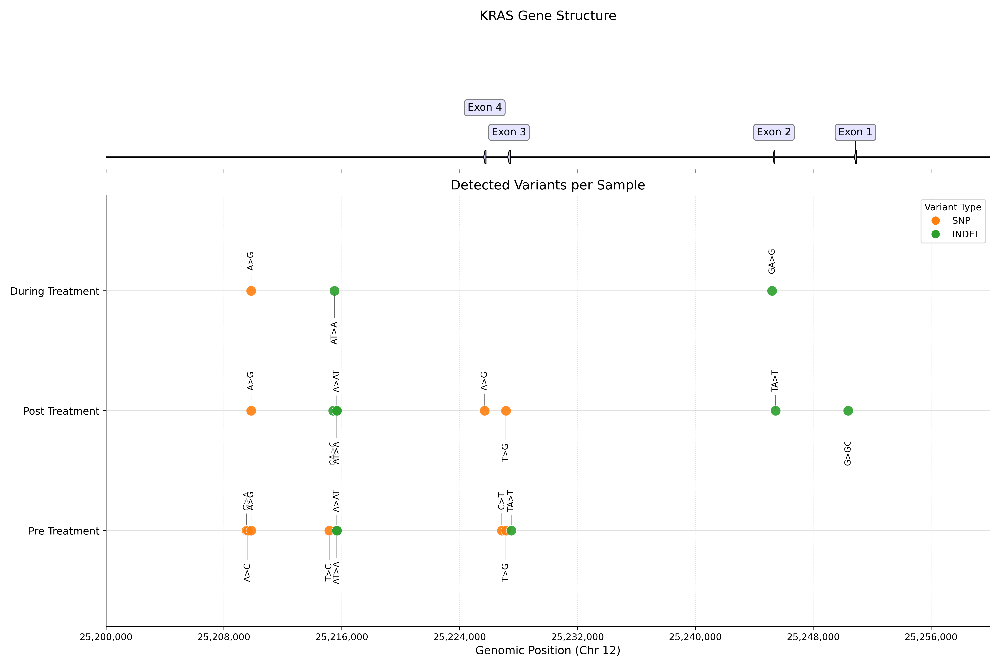

# NGS biomarker discovery toolkit

**NGS Variant Calling & Digital PCR Assay Design for Circulating Tumor DNA Analysis**

**Author:** Luis Aguilera

[](https://opensource.org/licenses/BSD-3-Clause)

## Description

This code is based on [Circulating tumor DNA sequencing in colorectal cancer patients treated with first-line chemotherapy with anti-EGFR.](https://www.nature.com/articles/s41598-021-95345-4).

This code aims to identify potential variant allele frequency changes that serve as biomarkers for monitoring treatment response and tumor evolution. Then, Digital PCR Assay Development is implemented based on variant allele detection.


## Data

**Source:** NCBI SRA BioProject [PRJNA714799](https://www.ncbi.nlm.nih.gov/bioproject/PRJNA714799)

**Access & Organization:**
The pipeline uses `pysradb` to fetch metadata and parses the `run_alias` field to organize samples. The data structure is derived as follows:

- **Sample Types**:
  - `PBMC`: Germline control (e.g., `PBMC_CTC030`)
  - `FFPE`: Tumor tissue (e.g., `FFPE_CTC030`)
  - `ctDNA`: Plasma samples (e.g., `CTC030-1`)

- **Patient IDs**: Extracted from the alias prefix (e.g., `CTC030`, `C_fw01`).

- **Timepoints**:
  - **Baseline (Pre-treatment)**: No suffix or `-0` (e.g., `CTC030`).
  - **Follow-up (During/Post)**: Integer suffixes (e.g., `-1`, `-2`).
  - **Clinical Annotation**: Timepoints are automatically mapped to:
    - `Pre-treatment`: Baseline (0)
    - `During treatment`: First follow-up
    - `Post-treatment`: Final timepoint

## Installation

### Prerequisites

- [Anaconda](https://www.anaconda.com) or Miniconda
- ~50 GB disk space for reference genome and sequencing data

To install this repository and all its dependencies, we recommend using [Anaconda](https://www.anaconda.com).

- Clone the repository:

```sh
git clone https://github.com/luisub/NGS_biomarker_discovery_toolkit.git
```

- Create a virtual environment from the `environment.yml` file and activate it:

```sh
conda env create -f environment.yml
conda activate vca_env
```

## Workflow & Code Architecture

The analysis follows a 3-step process. Each step corresponds to a specific notebook and directory in the repository.

### 1. Variant Calling Analysis

**Goal**: Identify somatic variants (SNPs/Indels) from NGS data.

- **Notebook**: [vca_pipeline.ipynb](pipelines_vca/vca_pipeline.ipynb)
- **Directory**: `pipelines_vca/`
- **Output**: Annotated VCF files (`pipelines_vca/data/variants/*.lofreq.ann.vcf.gz`).

| Analysis Name | Input File Type | Output File Type | Description |
| :--- | :--- | :--- | :--- |
| **Quality Control** | Raw FASTQ (`.fastq.gz`) | HTML Report | Quality assessment of raw sequencing reads using FastQC. |
| **Read Trimming** | Raw FASTQ (`.fastq.gz`) | Trimmed FASTQ (`.trimmed.fastq.gz`) | Removal of adapters and low-quality bases using fastp. |
| **Alignment** | Trimmed FASTQ | Sorted BAM (`.sorted.bam`) | Alignment of reads to GRCh38 reference genome using BWA-MEM. |
| **Duplicate Removal** | Sorted BAM | Deduplicated BAM (`.dedup.bam`) | Marking and removal of PCR duplicates using Samtools. |
| **BQSR** | Deduplicated BAM | Recalibrated BAM (`.bqsr.bam`) | Base quality score recalibration using LoFreq Viterbi HMM. |
| **Variant Calling** | Recalibrated BAM | VCF (`.lofreq.vcf`) | High-sensitivity somatic variant calling using Lofreq. |
| **Variant Annotation** | VCF (`.lofreq.vcf`) | Annotated VCF (`.ann.vcf.gz`) | Functional annotation of variants using SnpEff. |
| **Germline Filtering** | Annotated VCF | Somatic VCF (`.somatic.vcf.gz`) | Filter germline variants using gnomAD population frequencies. |
| **Visualization** | Somatic VCF | Plots (PNG) | Visualization of variants on gene and protein structures. |



#### Pipeline Implementations

The Variant Calling workflow is available in **two implementations**:

| Implementation | Location | Use Case | Status |
|----------------|----------|----------|--------|
| **Nextflow** | `nextflow/` | 🚀 **Production** - HPC, Cloud, Batch processing | Recommended |
| **Python** | `pipelines_vca/` | 🔧 **Development** - Prototyping, Single samples | For testing |

**When to use Nextflow (Production):**

- Processing multiple samples (batch mode)
- Running on HPC clusters (SLURM, PBS) or cloud (AWS Batch)
- Need reproducibility with containers (Singularity/Docker)
- Need automatic resume on failure

**When to use Python (Development):**

- Rapid prototyping and testing new features
- Debugging and development
- Single sample analysis
- Jupyter notebook integration

> **Note:** New features are typically developed in Python first, validated, then ported to Nextflow for production use.

### 2. Primer Design

**Goal**: Design dual-color ddPCR assays for detected variants.

- **Notebook**: [ddpcr_primer_design.ipynb](digital_PCR/ddpcr_primer_design.ipynb)
- **Directory**: `digital_PCR/`
- **Output**: Primer/Probe sequences (`ddpcr_snp_assays.csv`) and virtual gel images.


### 3. Digital PCR Simulation

**Goal**: Simulate ddPCR droplet partitioning and rare mutation detection.

- **Notebook**: [ddpcr_simulation.ipynb](digital_PCR/ddpcr_simulation.ipynb)
- **Directory**: `digital_PCR/`
- **Output**: Simulated 1D/2D plots and Limit of Detection (LOD) analysis.


## Code Architecture

### Module Overview

| Module | Purpose | Independent? | Status |
|--------|---------|--------------|--------|
| `nextflow/` | 🚀 Production variant calling pipeline | ✅ Yes | **Production** |
| `pipelines_vca/` | 🔧 Python variant calling (dev/test) | ✅ Yes | Development |
| `digital_PCR/` | 🧪 ddPCR primer design & simulation | ✅ Yes | Complete |
| `machine_learning/` | 🤖 Biomarker prediction models | ✅ Yes | Planned |

### Directory Structure

```text
NGS_biomarker_discovery_toolkit/
│
├── 📁 nextflow/                    # ⚡ PRODUCTION PIPELINE (Nextflow DSL2)
│   ├── main.nf                     # Pipeline entrypoint
│   ├── modules/                    # Process definitions (BQSR, LoFreq, etc.)
│   ├── subworkflows/               # Reusable workflow components
│   ├── conf/                       # Execution profiles (slurm, docker, etc.)
│   ├── docs/                       # Pipeline documentation
│   └── test/                       # Test data and configs
│
├── 📁 pipelines_vca/               # 🐍 PYTHON PIPELINE (Development)
│   ├── run_vca_pipeline.py         # Main script (all steps integrated)
│   ├── config.yaml                 # Pipeline configuration
│   ├── plots_sequences.py          # Visualization utilities
│   └── data_cluster/               # Data storage (reference, aligned, variants)
│
├── 📁 digital_PCR/                 # 🧬 DIGITAL PCR MODULE (Independent)
│   ├── ddpcr_primer_design.ipynb   # Primer/probe design workflow
│   ├── ddpcr_simulation.ipynb      # Droplet partitioning simulation
│   ├── pcr_visualization.py        # Gel electrophoresis visualization
│   └── ddpcr_snp_assays.csv        # Output: Designed assays
│
├── 📁 machine_learning/            # 🤖 ML MODULE (Planned)
│   └── TODO_ML.md                  # Development roadmap
│
├── 📁 docs/                        # 📚 Project documentation
├── 📁 config/                      # ⚙️ Shared configuration
├── environment.yml                 # Conda environment
└── README.md                       # This file
```

### Module Relationships

```text
                ┌─────────────────────────────────────────┐
                │        Variant Calling Analysis         │
                │                                         │
                │  ┌─────────────┐   ┌─────────────────┐  │
                │  │  nextflow/  │   │ pipelines_vca/  │  │
                │  │ (Production)│   │ (Development)   │  │
                │  └──────┬──────┘   └────────┬────────┘  │
                │         │ VCF output        │           │
                └─────────┼───────────────────┼───────────┘
                          │                   │
                          ▼                   ▼
              ┌───────────────────────────────────────────┐
              │              digital_PCR/                 │
              │     Primer Design & ddPCR Simulation      │
              │         (Uses VCF as optional input)      │
              └───────────────────────────────────────────┘
                                    │
                                    ▼
              ┌───────────────────────────────────────────┐
              │           machine_learning/               │
              │     Biomarker Discovery (Future)          │
              │      (Uses variant data as input)         │
              └───────────────────────────────────────────┘
```

## Getting Started

### Quick Start - Nextflow (Recommended)

```bash
# Run the production pipeline
cd nextflow
nextflow run main.nf \
    --input samplesheet.csv \
    --genome_fasta /path/to/GRCh38.fa \
    -profile singularity
```

### Quick Start - Python (Development)

```bash
# Run the Python pipeline
cd pipelines_vca
python run_vca_pipeline.py config.yaml
```

### Digital PCR (Independent)

```bash
# Open Jupyter and run the notebooks
cd digital_PCR
jupyter notebook ddpcr_primer_design.ipynb
```

## Project Planning Documents

**[TODO List](TODO.md)** - Comprehensive development roadmap with prioritized tasks.

## License

This project is licensed under the BSD 3-Clause License - see the LICENSE file for details.
